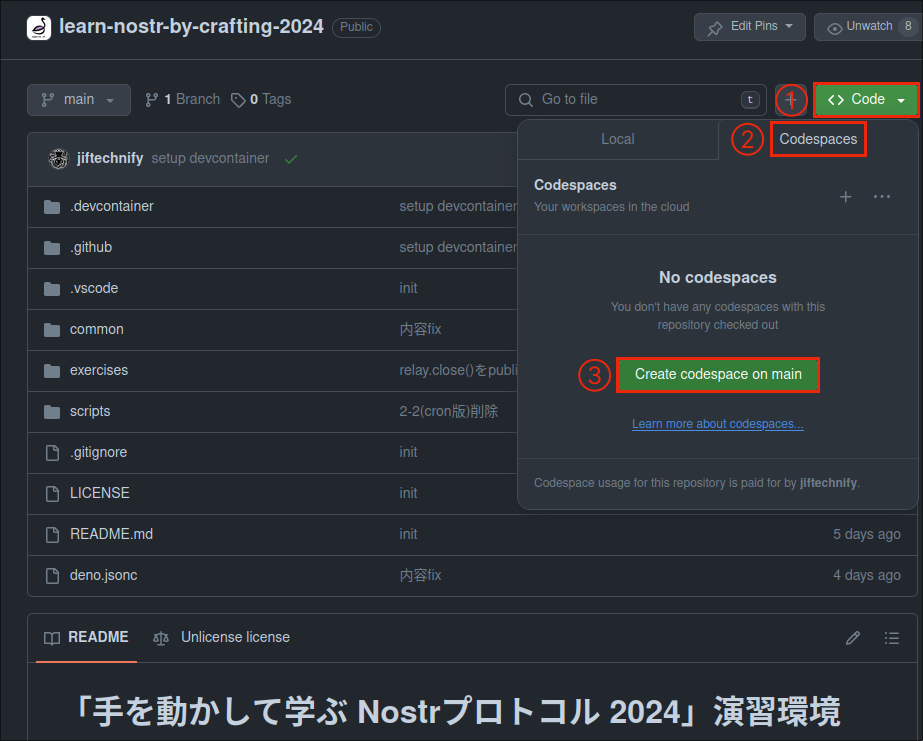

# 「手を動かして学ぶ Nostrプロトコル 2024」演習環境

[Hello Nostr, Yo Bluesky 2 最先端分散型SNSの愉快な仲間たち](https://)([技術書典16](https://techbookfest.org/)にて頒布)内の記事、「手を動かして学ぶ Nostrプロトコル 2024」の演習環境です。

## セットアップ
### GitHub Codespacesを利用する方法(オススメ！)

GitHubのアカウントを持っていない場合は、まず画面右上の「Sign up」よりアカウントを作成してください。

GitHubアカウントでログインした状態で以下の操作を行います。
1. 緑色の「Code」ボタンをクリック
2. 開いたドロップダウン内の「Codespaces」タブをクリック
3. 「Create codespaces on main」をクリック



「Setting up your codespace」という画面でしばらく待機していると、エディタ画面に切り替わるはずです。
以上で、必要なものがすべて揃った環境の準備ができました！

--- 

<details>
<summary>ローカルマシン上にセットアップ(開発者向け)</summary>

### ローカルマシンに開発コンテナ(Dev Containers)を利用してセットアップ

前提: Visual Studio Code (以下 VSCode と表記) と Docker のインストール

1. この演習環境リポジトリをクローンし、VSCodeでディレクトリを開きます。

```bash
git clone https://github.com/nostr-jp/learn-nostr-by-crafting-2024.git
code learn-nostr-by-crafting-2024
```

2. VSCode内でコマンド「Dev Containers: Reopen in Container(開発コンテナ: コンテナで再度開く)」を実行します。

開発コンテナ内でエディタが開いたら準備完了です。


### ローカルマシンに手動でセットアップ

1. [Deno](https://deno.com/runtime)をインストールします(既にインストール済みの場合はスキップしてください)。

```bash
# macOS または Linux の場合
curl -fsSL https://deno.land/x/install/install.sh | sh

# Windows の場合 (PowerShell)
irm https://deno.land/install.ps1 | iex
```

2. 次に、以下のコマンドで演習環境をクローンし、演習環境のディレクトリに移動します。

```bash
git clone https://github.com/nostr-jp/learn-nostr-by-crafting-2024.git
```

3. お好みのエディタで演習環境のディレクトリを開きます。
  - 必要に応じてDenoでのプログラミング用の拡張機能・プラグインをインストールするとよいでしょう

</details>

## 演習の進め方

演習は大きく「1. 基礎編」と「2. Bot実装編」の2章に分かれており、各章中の節ごとに「コードを書く→実行する」を行います。

### コードを書く
本文中の次のような囲みにたどり着いたら、演習環境の`exercises`フォルダ内の囲み上部に示された名前のファイルの該当箇所へ、囲み内のコードを書き写してください(各行の「//」以降の部分はコメントなので、書き写すは必要ありません)。

> [!NOTE]
>
> `exercises`フォルダ内のファイルに書かれている`TODO`は、必要に応じて削除してかまいません。

```1_basics.ts
// 1-x. (節タイトル)

... コード ...

// 1-x. ここまで
```

### 実行する
本文中の次のような囲みにたどり着いたら、ターミナルを開いて囲み内のコマンドを入力し、Enter/Returnキーを押下して実行します。

```terminal
deno task e1-x
```
